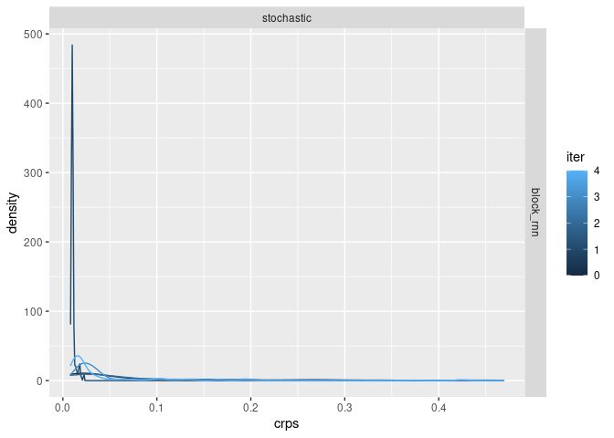

scoring
================
2022-04-13

``` r
library(scoringRules)
library(tidyverse)
```

    ## ── Attaching packages ─────────────────────────────────────── tidyverse 1.3.1 ──

    ## ✓ ggplot2 3.3.5     ✓ purrr   0.3.4
    ## ✓ tibble  3.1.6     ✓ dplyr   1.0.8
    ## ✓ tidyr   1.2.0     ✓ stringr 1.4.0
    ## ✓ readr   2.1.2     ✓ forcats 0.5.1

    ## ── Conflicts ────────────────────────────────────────── tidyverse_conflicts() ──
    ## x dplyr::filter() masks stats::filter()
    ## x dplyr::lag()    masks stats::lag()

``` r
data <- read_csv("forecasts/block_rnn_stochastic_10.csv.gz")[-1]
```

    ## New names:
    ## Rows: 675000 Columns: 9
    ## ── Column specification
    ## ──────────────────────────────────────────────────────── Delimiter: "," chr
    ## (2): tp_model, ml_model dbl (6): ...1, time, ensemble, value, case, iter lgl
    ## (1): true_model
    ## ℹ Use `spec()` to retrieve the full column specification for this data. ℹ
    ## Specify the column types or set `show_col_types = FALSE` to quiet this message.
    ## • `` -> `...1`

``` r
library(scoringRules)

# trivial wrapper to score both logs and crps
scores <- function(observed, predicted) {
  logsscore <- scoringRules::logs_sample(observed, predicted)
  crpsscore <- scoringRules::crps_sample(observed, predicted)
  # drops the first point (initial condition)
  data.frame(logs = mean(logsscore[-1]), crps =  mean(crpsscore[-1]))
}
```

``` r
score_all <- function(data, groups = NULL) {
    
true <- data |> filter(true_model)
fcst <- data |> filter(!true_model)

# key trick is to make forecast a t_max x ensembles matrix for scoringRules:
predicted <- fcst |>
  select(t = time, i = ensemble, value) |> 
  pivot_wider(id_cols = "t", names_from="i", values_from = "value") |> 
  select(-t) |> 
  as.matrix()

# just select and rename relevant columns
test <- true |>  select(t = time, i = ensemble, value)

# Here we go! score each test timeseries against the entire predicted ensemble!
rep_scores <- 
  test |> 
  group_by(i) |> 
  group_map(~ scores(.x$value, predicted)) |> 
  bind_rows()

# add any "grouping variables" on as additional columns for bookkeeping
bind_cols(rep_scores, groups)
}
```

``` r
# now actually run the scoring over all iterations, ml_models, tp_models:

bench::bench_time({
rep_scores <- data |> 
  group_by(iter, ml_model, tp_model) |>
  group_map(~ score_all(.x, .y) ,.keep = TRUE) |> 
  bind_rows()

})
```

    ## process    real 
    ##   29.7s   29.7s

``` r
# rough plot, probably not the best visual of this.
ggplot(rep_scores) + 
  geom_density(aes(crps, color=iter, group=iter)) + 
  facet_grid(ml_model~tp_model)
```

<!-- -->
