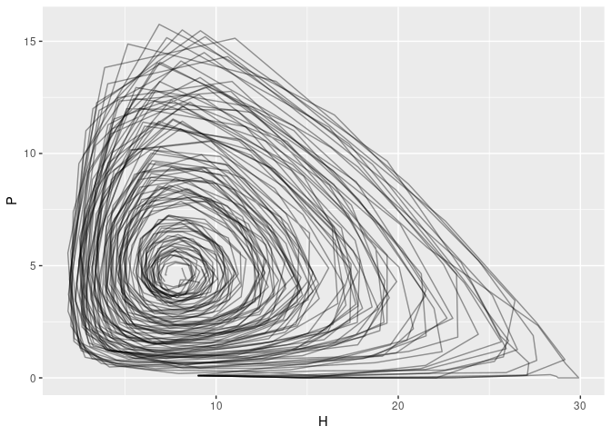
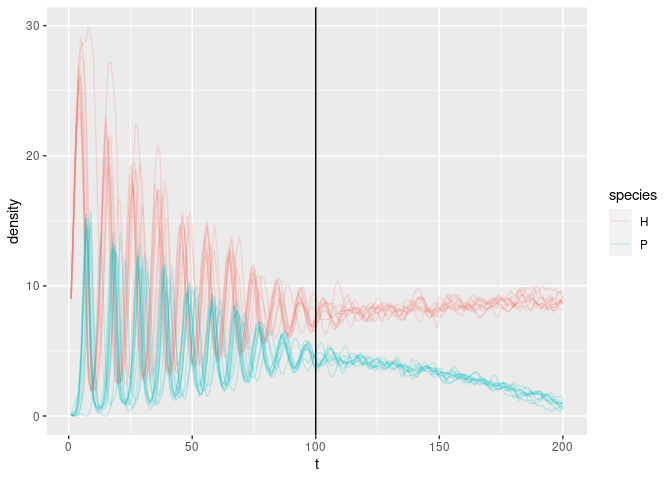

``` r
library(tidyverse)
```

    ## ── Attaching packages ─────────────────────────────────────── tidyverse 1.3.1 ──

    ## ✓ ggplot2 3.3.5     ✓ purrr   0.3.4
    ## ✓ tibble  3.1.6     ✓ dplyr   1.0.8
    ## ✓ tidyr   1.2.0     ✓ stringr 1.4.0
    ## ✓ readr   2.1.2     ✓ forcats 0.5.1

    ## ── Conflicts ────────────────────────────────────────── tidyverse_conflicts() ──
    ## x dplyr::filter() masks stats::filter()
    ## x dplyr::lag()    masks stats::lag()

``` r
library(greta)
```

    ## 
    ## Attaching package: 'greta'

    ## The following object is masked from 'package:dplyr':
    ## 
    ##     slice

    ## The following objects are masked from 'package:stats':
    ## 
    ##     binomial, cov2cor, poisson

    ## The following objects are masked from 'package:base':
    ## 
    ##     %*%, apply, backsolve, beta, chol2inv, colMeans, colSums, diag,
    ##     eigen, forwardsolve, gamma, identity, rowMeans, rowSums, sweep,
    ##     tapply

``` r
library(bayesplot)
```

    ## This is bayesplot version 1.8.1

    ## - Online documentation and vignettes at mc-stan.org/bayesplot

    ## - bayesplot theme set to bayesplot::theme_default()

    ##    * Does _not_ affect other ggplot2 plots

    ##    * See ?bayesplot_theme_set for details on theme setting

``` r
set.seed(4242)
train_reps <- 10
train_t_max <- 100
test_t_max <- 100
test_reps <- 100


np.clip <- function(x, a, b) {
  if(x < a) return(a)
  if(x > b) return(b)
  x
}
```

``` r
# Cycles start around K >= 21
# some stochastic resonance visible before then
step <- function(N, eta,  r = 0.75, c = 0.25, Ko = 15, delta=0.1, t=1) {
  
  # K will go linearly from 15 to 25 with delta = 0.1
  # Make delta negative and start with a bigger Ko to run in reverse
  K <- Ko + delta*t
  
  Nt <- numeric(2)
  Nt[1] <- N[1] * exp(r * (1 - N[1]/K) - c * N[2] + eta[1])
  Nt[2] <- N[1] * exp(r * (1 - N[1]/K) ) * (1 - exp(-c * N[2]+ eta[2]) )
  Nt[1] <- np.clip(Nt[1], 0, 100)
  Nt[2] <- np.clip(Nt[2], 0, 100)

  Nt
}

# simulate
simulate <- function(N_init = c(9,.1),
                     t_max = 100,
                     mu =0, # -5e-4,
                     sigma = 2e-2,
                     r = 0.75, 
                     c = 0.1,
                     Ko = 15,
                     delta = 0.1
                     ) {
  eta <- array(rnorm(2*t_max, mu, sigma), c(t_max,2))
  N   <- array(NA, c(t_max,2))
  
  N[1,] <- N_init
  for (t in 1:(t_max-1)) {
    N[t+1,] <- step(N[t,], eta[t,], r=r, c=c, Ko=Ko, delta=delta, t=t)
  }
  tibble::tibble(t = 1:t_max, H = N[,1], P = N[,2])
}
```

``` r
t_max <- train_t_max + test_t_max
sim <- purrr::map_dfr(1:train_reps, \(i) simulate(t_max=t_max, delta=-0.1, Ko=30), .id = "i")
train <- sim |> filter(t <= train_t_max)
test <- sim |> filter(t > train_t_max)
# test <- purrr::map_dfr(1:test_reps, \(i) simulate(t_max=test_t_max), .id = "i")

## show training data
train |> ggplot(aes(H, P, group=i)) + geom_path(alpha=0.4)
```

<!-- -->

``` r
sim |> 
  pivot_longer(c(P,H), values_to="density", names_to="species") |>
  ggplot(aes(t, density, col=species, group=interaction(i,species))) + geom_line(alpha=0.2) +
  geom_vline(aes(xintercept = train_t_max))
```

<!-- -->
