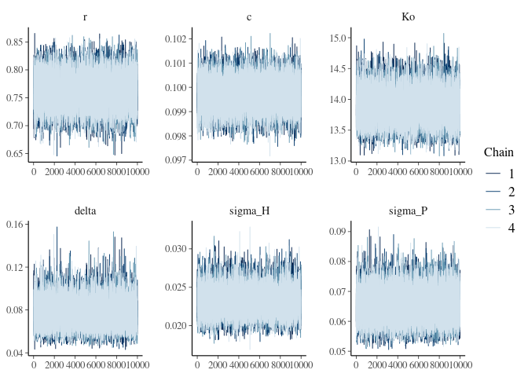
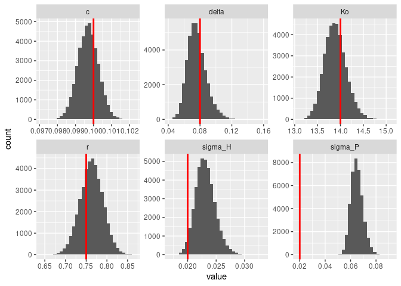
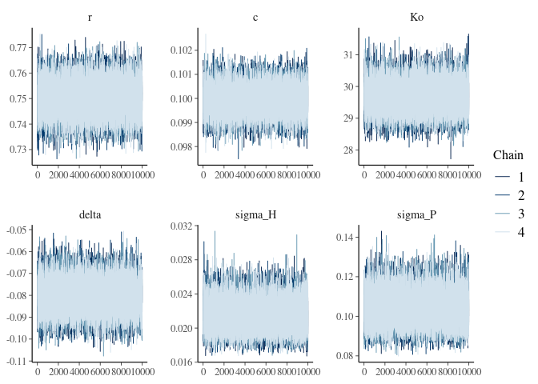

Cycles start around `K >= 21`, though some stochastic resonance visible
before then. `K` will go linearly from 15 to 25 with `delta = 0.1`. Make
delta negative and start with a bigger `Ko` to run in reverse.

``` r
library(tidyverse, quietly = TRUE)
library(greta, quietly = TRUE)
library(bayesplot, quietly = TRUE)
source("R/utils.R")
source("R/hopf.R")
```

``` r
set.seed(4242)
train_reps <- 1
train_t_max <- 100
test_t_max <- 100
test_reps <- 100

simulate <- simulate_hopf
```

# Increasing K

``` r
t_max <- train_t_max + test_t_max
 p = list(H_init = 9, 
          P_init = 1,
          r = 0.75, 
          c = 0.1,
          Ko = 14,
          delta = 0.08,
          sigma_H = 2e-2,
          sigma_P = 2e-2,
          t_init = 0)

sim <- purrr::map_dfr(1:test_reps, 
                      \(i) simulate(t_max=t_max, p = p),
                      .id = "i")
train <- sim |> filter(t <= train_t_max, i <= train_reps)
test <- sim |> filter(t > train_t_max)
```

``` r
m <- greta_model_hopf(train)
```

    ## ℹ Initialising python and checking dependencies, this may take a moment.

    ## ✓ Initialising python and checking dependencies ... done!

    ## 

``` r
draws <- mmcmc(m, 
             n_samples = 10000, warmup = 5000,
             chains = 4, verbose = FALSE)
```

## MCMC evaluation

``` r
bayesplot::mcmc_trace(draws)
```

<!-- -->

``` r
plot_posteriors(draws,p)
```

<!-- -->

``` r
combined <-  compare_forecast(draws, train, test, simulate, vars = c("H", "P"),
                              test_reps, test_t_max)
```

    ## Note: Using an external vector in selections is ambiguous.
    ## ℹ Use `all_of(vars)` instead of `vars` to silence this message.
    ## ℹ See <https://tidyselect.r-lib.org/reference/faq-external-vector.html>.
    ## This message is displayed once per session.

``` r
write_csv(combined, "data/hopf_increasing.csv.gz")
```

``` r
combined |> 
  group_by(t,type,variable) |> 
  summarise(mean = mean(value), sd = sd(value), .groups = "drop") |> 
 ggplot(aes(t, col=type)) + 
  geom_ribbon(aes(ymin = mean-2*sd, ymax = mean+2*sd, fill=type), alpha=0.5) +
  geom_line(aes(y=mean)) +
  geom_vline(aes(xintercept = train_t_max)) + facet_wrap(~variable, ncol=1)
```

    ## Warning in max(ids, na.rm = TRUE): no non-missing arguments to max; returning
    ## -Inf

    ## Warning in max(ids, na.rm = TRUE): no non-missing arguments to max; returning
    ## -Inf

<!-- -->

``` r
single <- 
  combined |> 
  filter(i %in% 1:train_reps) |> 
  ggplot(aes(t, value, col=type, group=interaction(i,type))) + 
    geom_line() +
    geom_vline(aes(xintercept = train_t_max)) + facet_wrap(~variable, ncol=1)
```

``` r
scores <- 
  bind_rows(
    rep_scores(combined, "P"),
    rep_scores(combined, "H") 
  ) |> 
  mutate(scenario="hopf_increasing", model="MCMC")
```

# Decreasing K

``` r
t_max <- train_t_max + test_t_max
p = p
p$delta <- -0.08
p$Ko <- 30

sim <- purrr::map_dfr(1:test_reps, 
                      \(i) simulate(t_max=t_max, p = p),
                      .id = "i")
train <- sim |> filter(t <= train_t_max, i <= train_reps)
test <- sim |> filter(t > train_t_max)
```

``` r
m2 <- greta_model_hopf(train)
draws2 <- mmcmc(m2, 
               n_samples = 10000, warmup = 5000,
               chains = 4, verbose = FALSE)
```

## MCMC evaluation

``` r
bayesplot::mcmc_trace(draws2)
```

<!-- -->

``` r
plot_posteriors(draws2, p)
```

<!-- -->

``` r
combined <- compare_forecast(draws2, train, test, simulate, vars = c("H", "P"),
                              test_reps, test_t_max) 

write_csv(combined, "data/hopf_decreasing.csv.gz")
```

``` r
combined |> 
  group_by(t,type,variable) |> 
  summarise(mean = mean(value), sd = sd(value), .groups = "drop") |> 
   ggplot(aes(t, col=type)) + 
    geom_ribbon(aes(ymin = mean-2*sd, ymax = mean+2*sd, fill=type), alpha=0.5) +
    geom_line(aes(y=mean)) +
    geom_vline(aes(xintercept = train_t_max)) + facet_wrap(~variable, ncol=1)
```

    ## Warning in max(ids, na.rm = TRUE): no non-missing arguments to max; returning
    ## -Inf

    ## Warning in max(ids, na.rm = TRUE): no non-missing arguments to max; returning
    ## -Inf

<!-- -->

``` r
single <- combined |> 
  filter(i %in% 1:train_reps) |> 
  ggplot(aes(t, value, col=type, group=interaction(i,type))) + 
  geom_line() +
  geom_vline(aes(xintercept = train_t_max)) +
  facet_wrap(~variable, ncol=1)
```

# Scoring

``` r
scores <- 
  bind_rows(
    rep_scores(combined, "P"),
    rep_scores(combined, "H") 
  ) |> 
  mutate(scenario="hopf_decreasing", 
         model="MCMC", 
         reps = train_reps) |>
  bind_rows(scores)

write_csv(scores, "data/scores_hopf.csv.gz")
```

``` r
scores |> ggplot(aes(variable, crps)) + geom_boxplot() + facet_wrap(~scenario)
```

<!-- -->
