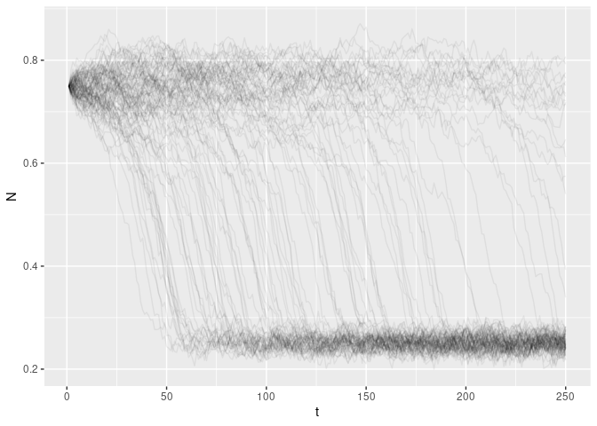
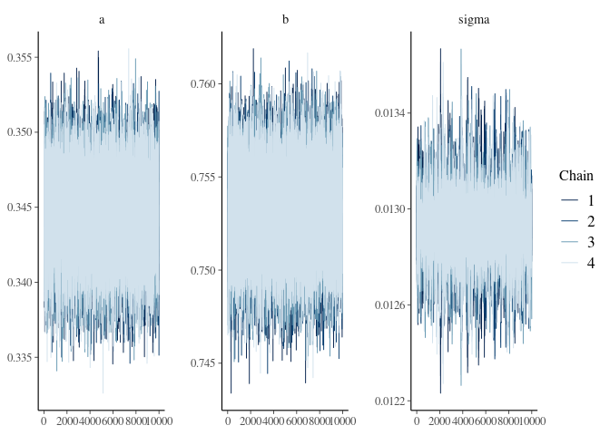

``` r
library(tidyverse)
```

    ## ── Attaching packages ─────────────────────────────────────── tidyverse 1.3.1 ──

    ## ✓ ggplot2 3.3.5     ✓ purrr   0.3.4
    ## ✓ tibble  3.1.6     ✓ dplyr   1.0.8
    ## ✓ tidyr   1.2.0     ✓ stringr 1.4.0
    ## ✓ readr   2.1.2     ✓ forcats 0.5.1

    ## ── Conflicts ────────────────────────────────────────── tidyverse_conflicts() ──
    ## x dplyr::filter() masks stats::filter()
    ## x dplyr::lag()    masks stats::lag()

``` r
set.seed(1234567)

np.clip <- function(x, a, b) {
  if(x < a) return(a)
  if(x > b) return(b)
  x
}

# View the bistable curve: 
# curve( (0.75 - x)**2 * (0.25 - x), 0, 1)

step <- function(N, eta,  a = 0.75, b = 0.25) {
  N <- N + (a - N)**2 * (b - N) + eta
  N <- np.clip(N, 0, 1)
  N
}

# simulate
simulate <- function(N_init = 0.75,
                     t_max = 250L,
                     mu =0, # -5e-4,
                     sigma = 1e-2,
                     a = 0.75, 
                     b = 0.25) {
  eta <- rnorm(t_max, mu, sigma)
  N   <- numeric(t_max)
  N[1] <- N_init
  for (t in 1:(t_max-1)) {
    N[t+1] <- step(N[t], eta[t], a = a, b = b)
  }
  tibble::tibble(t = 1:t_max, N = N)
}

sims <- purrr::map_dfr(1:100, \(i) simulate(), .id = "i")
sims |> ggplot(aes(t, N, group=i)) + geom_line(alpha=0.06)
```

<!-- -->

``` r
gsims <- sims |> group_by(i) |> mutate(xt1 = lead(N)) |> filter(t<max(t))

x_t <- gsims$N
x_t1 <- gsims$xt1

library(greta)
```

    ## 
    ## Attaching package: 'greta'

    ## The following object is masked from 'package:dplyr':
    ## 
    ##     slice

    ## The following objects are masked from 'package:stats':
    ## 
    ##     binomial, cov2cor, poisson

    ## The following objects are masked from 'package:base':
    ## 
    ##     %*%, apply, backsolve, beta, chol2inv, colMeans, colSums, diag,
    ##     eigen, forwardsolve, gamma, identity, rowMeans, rowSums, sweep,
    ##     tapply

``` r
a <- uniform(0, 10)
```

    ## ℹ Initialising python and checking dependencies, this may take a moment.

    ## ✓ Initialising python and checking dependencies ... done!

    ## 

``` r
b <- uniform(0, 10)
sigma <- uniform(0, 10)
mean <-  x_t + (a - x_t) ^ 2 * (b - x_t)
distribution(x_t1) <- normal(mean, sigma )
m <- model(a, b, sigma)
```

``` r
mmcmc <- memoise::memoise(mcmc, cache = memoise::cache_filesystem("mcmc_cache"))


bench::bench_time({                 
  draws <- mmcmc(m, n_samples = 10000, warmup = 5000, chains = 4, verbose = FALSE)
})
```

    ## process    real 
    ##  99.6ms  99.7ms

``` r
bayesplot::mcmc_trace(draws)
```

<!-- -->

``` r
posterior_samples <- 
  bind_rows(map(draws, as_tibble)) %>% 
  sample_n(100)
posterior_sims <- posterior_samples %>%
  purrr::transpose() %>%
  map_dfr(function(q) simulate() ,.id = "i")

bind_rows(sims, posterior_sims, .id = "model")|> 
  ggplot(aes(t, N, col=model, group=interaction(model,i))) +
           geom_line(alpha=0.3)
```

<!-- -->

# Scoring

``` r
library(scoringRules)

observed <- sims %>% filter(i == 1) %>% pull(N)
posterior_sims
```

    ## # A tibble: 25,000 × 3
    ##    i         t     N
    ##    <chr> <int> <dbl>
    ##  1 1         1 0.75 
    ##  2 1         2 0.752
    ##  3 1         3 0.744
    ##  4 1         4 0.748
    ##  5 1         5 0.756
    ##  6 1         6 0.768
    ##  7 1         7 0.777
    ##  8 1         8 0.780
    ##  9 1         9 0.797
    ## 10 1        10 0.784
    ## # … with 24,990 more rows

``` r
dat <- posterior_sims |> pivot_wider(id_cols = "t", names_from="i", values_from = "N") |> select(-t) |> as.matrix()


score <- scoringRules::logs_sample(observed, dat)
logsscore <- score[-1] # drop first point
mean(logsscore)
```

    ## [1] -1.169741

``` r
score <- scoringRules::crps_sample(observed, dat)
crpsscore <- score[-1] # drop first point
mean(crpsscore)
```

    ## [1] 0.06299483
