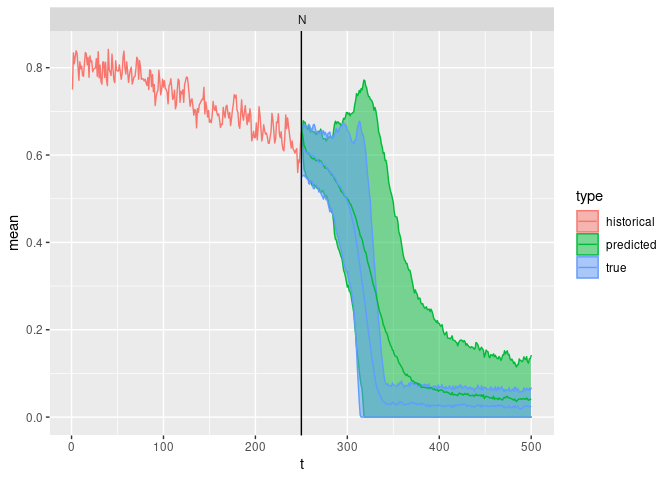
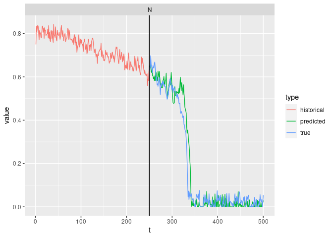

``` r
library(tidyverse)
```

    ## ── Attaching packages ─────────────────────────────────────── tidyverse 1.3.1 ──

    ## ✓ ggplot2 3.3.5     ✓ purrr   0.3.4
    ## ✓ tibble  3.1.6     ✓ dplyr   1.0.8
    ## ✓ tidyr   1.2.0     ✓ stringr 1.4.0
    ## ✓ readr   2.1.2     ✓ forcats 0.5.1

    ## ── Conflicts ────────────────────────────────────────── tidyverse_conflicts() ──
    ## x dplyr::filter() masks stats::filter()
    ## x dplyr::lag()    masks stats::lag()

``` r
library(greta)
```

    ## 
    ## Attaching package: 'greta'

    ## The following object is masked from 'package:dplyr':
    ## 
    ##     slice

    ## The following objects are masked from 'package:stats':
    ## 
    ##     binomial, cov2cor, poisson

    ## The following objects are masked from 'package:base':
    ## 
    ##     %*%, apply, backsolve, beta, chol2inv, colMeans, colSums, diag,
    ##     eigen, forwardsolve, gamma, identity, rowMeans, rowSums, sweep,
    ##     tapply

``` r
library(bayesplot)
```

    ## This is bayesplot version 1.8.1

    ## - Online documentation and vignettes at mc-stan.org/bayesplot

    ## - bayesplot theme set to bayesplot::theme_default()

    ##    * Does _not_ affect other ggplot2 plots

    ##    * See ?bayesplot_theme_set for details on theme setting

``` r
set.seed(4242)
train_reps <- 100
train_t_max <- 75
test_t_max <- 75
test_reps <- 100


np.clip <- function(x, a, b) {
  if(x < a) return(a)
  if(x > b) return(b)
  x
}
```

``` r
step <- function(N, 
                 eta,
                 t,
                 pars) {

        h <- np.clip(pars$h_init + pars$alpha * (pars$t_init + t), 0, 0.27)
        N <- N + pars$r * N * (1 - N / pars$K) - 
          h * (N**2 / (pars$s**2 + N**2)) + eta
        N <- np.clip(N, 0, 100)
        N
  N
}

# simulate
simulate <- function(N_init = 0.75,
                     t_max = 250L,
                     pars = list(
                        r = 1,
                        K = 1,
                        s = 0.1,
                        h_init = .15,
                        alpha = 0.0015,
                        mu = 0,
                        sigma = 0.00,
                        t_init = 0
                      )
                    ) {
  eta <- rnorm(t_max, pars$mu, pars$sigma) # mu = 0, no drift
  N   <- numeric(t_max)
  N[1] <- N_init
  for (t in 1:(t_max-1)) {
    N[t+1] <- step(N[t], eta[t], t, pars)
  }
  tibble::tibble(t = pars$t_init + 1:t_max, N = N)
}
```

``` r
pars = list(r = 1,
            K = 1,
            s = 0.1,
            h_init = .15,
            alpha = 0.0015,
            mu = 0,
            sigma = 0.02,
            t_init = 0
          )
t_max <- train_t_max + test_t_max
sims <- purrr::map_dfr(1:train_reps, 
                       \(i) simulate(t_max=t_max, pars = pars), 
                       .id = "i")

train <- sims |> filter(t <= train_t_max)
test <- sims |> filter(t > train_t_max)
```

``` r
sims <- bind_rows(test, train, .id = "data")
sims |> 
  ggplot(aes(t, N, group=interaction(i,data), col=data)) + 
  geom_line()
```

<!-- -->

``` r
gsims <- train |> group_by(i) |> mutate(xt1 = lead(N)) |> filter(t<max(t))
x_t <- gsims$N
x_t1 <- gsims$xt1
t <- gsims$t

library(greta)
r <- uniform(0, 10)
```

    ## ℹ Initialising python and checking dependencies, this may take a moment.

    ## ✓ Initialising python and checking dependencies ... done!

    ## 

``` r
K <- uniform(0, 10)
s <- uniform(0, 10)
h_init <- uniform(0, 10)
alpha <- uniform(0, 10)
sigma <- uniform(0, 10)
h <- h_init + alpha * t
mean <-  x_t + r*x_t*(1 - x_t / K) - h*(x_t^2 / (s^2 + x_t^2))
distribution(x_t1) <- normal(mean, sigma)
m <- model(r, K, s, h_init, alpha, sigma)
```

``` r
mmcmc <- memoise::memoise(mcmc, cache = memoise::cache_filesystem("sn_cache"))


bench::bench_time({                 
  draws <- mmcmc(m, n_samples = 100000, warmup = 80000, chains = 4, verbose = FALSE)
})
```

    ## process    real 
    ##  23.03h   1.62h

``` r
bayesplot::mcmc_trace(draws)
```

<!-- -->

``` r
## draw test_reps number of samples
left_off <- train |> 
  filter(t == train_t_max) |> 
  select(N) |> 
  rename(N_init = N) |>
  slice_sample(n = test_reps, replace=TRUE)

posterior_samples <- 
  bind_rows(map(draws, as_tibble)) |> 
  sample_n(test_reps) |>
  mutate(t_init = train_t_max) |>
  bind_cols(left_off)

posterior_sims <- posterior_samples |>
  mutate(mu=0) |>
  purrr::transpose() |>
  map_dfr(function(q) simulate(t_max = test_t_max, pars = q, N_init = q$N_init) ,.id = "i")

bind_rows(
  mutate(train, model="historical"),
  mutate(test, model="true"), 
  mutate(posterior_sims, model="predicted")
)|> 
  ggplot(aes(t, N, col=model, group=interaction(model,i))) +
           geom_line(alpha=0.2)
```

<!-- -->

``` r
true <- as_tibble(pars) |> gather(variable, value)
bind_rows(map(draws, as_tibble)) |>
  gather(variable, value) |> ggplot() + 
  geom_histogram(aes(value), bins = 30)  +
  geom_vline(data = true, aes(xintercept = value), col = "red", lwd = 1) + 
  facet_wrap(~variable, scales = "free")
```

<!-- -->

# Scoring

First, a single ‘observed’ sample from the true:

``` r
library(scoringRules)

scores <- function(observed, dat) {
  logsscore <- scoringRules::logs_sample(observed, dat)
  crpsscore <- scoringRules::crps_sample(observed, dat)
  data.frame(logs = mean(logsscore[-1]), crps =  mean(crpsscore[-1]))

}
# ensemble predictions
dat <- 
  posterior_sims |> 
  pivot_wider(id_cols = "t", names_from="i", values_from = "N") |> 
  select(-t) |> as.matrix()
```

``` r
# score over all replicates:
bench::bench_time({
rep_scores <- 
  test |> 
  group_by(i) |> 
  group_map(~ scores(.x$N, dat)) |> 
  bind_rows()
})
```

    ## process    real 
    ##   1.45s   1.45s

``` r
rep_scores |> summarise(across(.fns= base::mean))
```

    ##       logs     crps
    ## 1 -1.26119 0.037007

``` r
library(patchwork)
ggplot(rep_scores) + geom_histogram(aes(crps), bins=20) + 
(ggplot(rep_scores) + geom_histogram(aes(logs), bins=20) )
```

<!-- -->
