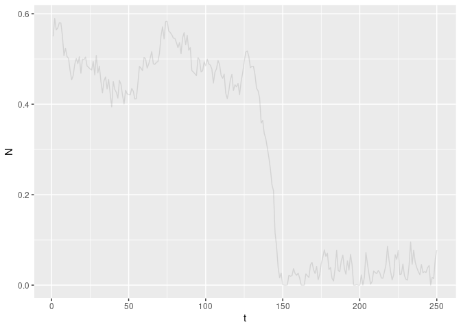
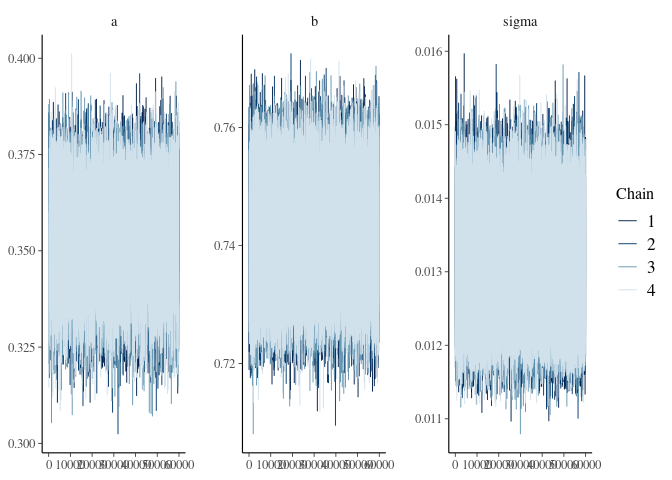
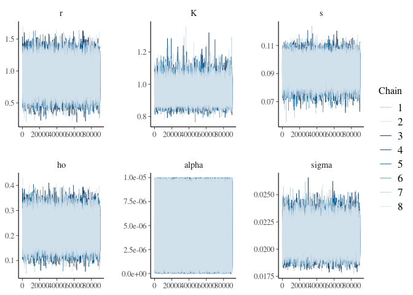
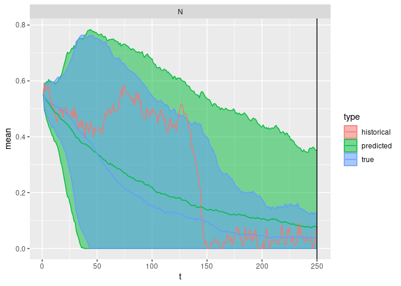
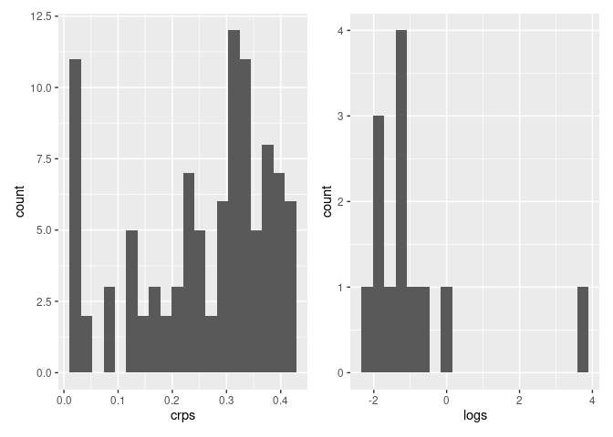

``` r
library(tidyverse)
```

    ## ── Attaching packages ──────────────────────────────────────────────────────────────────────────────────────────────── tidyverse 1.3.1 ──

    ## ✓ ggplot2 3.3.5     ✓ purrr   0.3.4
    ## ✓ tibble  3.1.6     ✓ dplyr   1.0.8
    ## ✓ tidyr   1.2.0     ✓ stringr 1.4.0
    ## ✓ readr   2.1.2     ✓ forcats 0.5.1

    ## ── Conflicts ─────────────────────────────────────────────────────────────────────────────────────────────────── tidyverse_conflicts() ──
    ## x dplyr::filter() masks stats::filter()
    ## x dplyr::lag()    masks stats::lag()

``` r
library(greta)
```

    ## 
    ## Attaching package: 'greta'

    ## The following object is masked from 'package:dplyr':
    ## 
    ##     slice

    ## The following objects are masked from 'package:stats':
    ## 
    ##     binomial, cov2cor, poisson

    ## The following objects are masked from 'package:base':
    ## 
    ##     %*%, apply, backsolve, beta, chol2inv, colMeans, colSums, diag,
    ##     eigen, forwardsolve, gamma, identity, rowMeans, rowSums, sweep,
    ##     tapply

``` r
library(bayesplot)
```

    ## This is bayesplot version 1.8.1

    ## - Online documentation and vignettes at mc-stan.org/bayesplot

    ## - bayesplot theme set to bayesplot::theme_default()

    ##    * Does _not_ affect other ggplot2 plots

    ##    * See ?bayesplot_theme_set for details on theme setting

``` r
set.seed(4242)
train_reps <- 1
train_t_max <- 250
test_t_max <- 250
test_reps <- 100


np.clip <- function(x, a, b) {
  if(x < a) return(a)
  if(x > b) return(b)
  x
}
```

``` r
# View the bistable curve: 
#curve( (0.75 - x)**2 * (0.25 - x), 0.749999, 0.750001)
#curve(0*x,0,1,add = TRUE)

#curve((0.25 - x)**2 * (0.75 - x), 0, 1)
#curve(0*x,0,1,add = TRUE)
```

``` r
step <- function(N, eta,  a = 0.75, b = 0.25) {
  N <- N + (a - N)**2 * (b - N) + eta
  N <- np.clip(N, 0, 1)
  N
}

# simulate
simulate <- function(N_init = 0.75,
                     t_max = 250L,
                       p = list(
                       sigma = 1e-2,
                       a = 0.75, 
                       b = 0.25)) {
  eta <- rnorm(t_max, 0, p$sigma) # mu = 0, no drift
  N   <- numeric(t_max)
  N[1] <- N_init
  for (t in 1:(t_max-1)) {
    N[t+1] <- step(N[t], eta[t], a = p$a, b = p$b)
  }
  tibble::tibble(t = 1:t_max, N = N)
}


train <- purrr::map_dfr(1:train_reps, \(i) simulate(t_max=train_t_max), .id = "i")
test <- purrr::map_dfr(1:test_reps, \(i) simulate(t_max=test_t_max), .id = "i")

## show training data
train |> ggplot(aes(t, N, group=i)) + geom_line(alpha=0.2)
```

<!-- -->

``` r
gsims <- train |> group_by(i) |> mutate(xt1 = lead(N)) |> filter(t<max(t))


x_t <- gsims$N
x_t1 <- gsims$xt1

library(greta)
a <- uniform(0, 10)
```

    ## ℹ Initialising python and checking dependencies, this may take a moment.✓ Initialising python and checking dependencies ... done!

``` r
b <- uniform(0, 1)
sigma <- uniform(0, 10)
mean <-  x_t + (a - x_t) ^ 2 * (b - x_t)
distribution(x_t1) <- normal(mean, sigma)
m <- model(a, b, sigma)
```

``` r
mmcmc <- memoise::memoise(mcmc, cache = memoise::cache_filesystem("mcmc_cache"))


bench::bench_time({                 
  draws <- mmcmc(m, n_samples = 60000, warmup = 50000, chains = 4, verbose = FALSE)
})
```

    ## process    real 
    ##   1.18h  26.15m

``` r
bayesplot::mcmc_trace(draws)
```

<!-- -->

``` r
## draw test_reps number of samples

posterior_samples <- 
  bind_rows(map(draws, as_tibble)) %>% 
  sample_n(test_reps)
posterior_sims <- posterior_samples %>%
  purrr::transpose() %>%
  map_dfr(function(q) simulate(t_max = test_t_max, p = q) ,.id = "i")

bind_rows(
  mutate(test, model="true"), 
  mutate(posterior_sims, model="predicted")
)|> 
  ggplot(aes(t, N, col=model, group=interaction(model,i))) +
           geom_line(alpha=0.1)
```

<!-- -->

``` r
true <- tibble(a = 0.75, b = 0.25, sigma = 1e-2) |> gather(variable, value)
bind_rows(map(draws, as_tibble)) |>
  gather(variable, value) |> ggplot() + 
  geom_histogram(aes(value), bins = 30)  +
  geom_vline(data = true, aes(xintercept = value), col = "red", lwd = 1) + 
  facet_wrap(~variable, scales = "free")
```

<!-- -->

# Scoring

First, a single ‘observed’ sample from the true:

``` r
library(scoringRules)

scores <- function(observed, dat) {
  logsscore <- scoringRules::logs_sample(observed, dat)
  crpsscore <- scoringRules::crps_sample(observed, dat)
  data.frame(logs = mean(logsscore[-1]), crps =  mean(crpsscore[-1]))

}
# ensemble predictions
dat <- 
  posterior_sims |> 
  pivot_wider(id_cols = "t", names_from="i", values_from = "N") |> 
  select(-t) |> as.matrix()
```

``` r
# score over all replicates:
bench::bench_time({
rep_scores <- 
  test |> 
  group_by(i) |> 
  group_map(~ scores(.x$N, dat)) |> 
  bind_rows()
})
```

    ## process    real 
    ##   4.68s   4.69s

``` r
rep_scores |> summarise(across(.fns= base::mean))
```

    ##   logs      crps
    ## 1  Inf 0.2569363

``` r
library(patchwork)
ggplot(rep_scores) + geom_histogram(aes(crps), bins=20) + 
(ggplot(rep_scores) + geom_histogram(aes(logs), bins=20) )
```

    ## Warning: Removed 87 rows containing non-finite values (stat_bin).

<!-- -->
