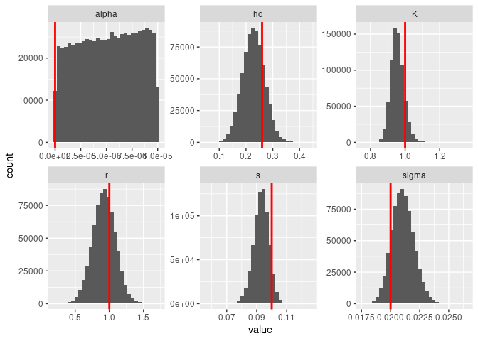
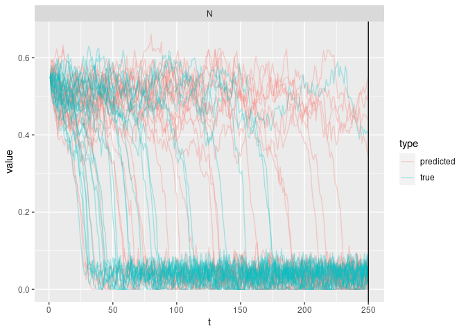

``` r
library(tidyverse, quietly = TRUE)
library(greta, quietly = TRUE)
library(bayesplot, quietly = TRUE)
source("R/utils.R")
source("R/saddle_node.R")
```

``` r
set.seed(4242)
train_reps <- 1
train_t_max <- 250
test_t_max <- 250
test_reps <- 100
simulate <- simulate_sn
```

``` r
p <- list(r = 1,
          K = 1,
          s = 0.1,
          ho = .26,
          alpha = 0.0,
          sigma = 0.02,
          t_init = 0,
          N_init = 0.55
        )
train <- purrr::map_dfr(1:train_reps, \(i) simulate(t_max=train_t_max, p), .id = "i")
test <- purrr::map_dfr(1:test_reps, \(i) simulate(t_max=test_t_max, p), .id = "i")
```

``` r
ggplot(train, aes(t, N, group=i)) + geom_line(alpha=0.1)
```

<!-- -->

``` r
m <- greta_model_sn(train, 
                    r     = uniform(0, 2),
                    K     = uniform(0, 2),
                    s     = uniform(0.0, 1),
                    ho    = uniform(0, 1),
                    alpha = uniform(0,0.00001),
                    sigma = uniform(0, 0.05))
```

    ## ℹ Initialising python and checking dependencies, this may take a moment.

    ## ✓ Initialising python and checking dependencies ... done!

    ## 

``` r
bench::bench_time({                 
  draws <- mmcmc(m, n_samples = 90000, warmup = 70000,
                 chains = 8, verbose = FALSE)
})
```

    ## process    real 
    ##   3.59h   1.34h

``` r
## draw test_reps number of samples
inits <- data.frame(N_init=p$N_init, t_init = 0)
combined <- compare_forecast(draws, train, test, simulate, vars = "N",
                              test_reps, test_t_max, inits = inits
                             ) 
write_csv(combined, "data/stochastic.csv.gz")
```

``` r
scores <-
  rep_scores(combined, "N") |> 
  mutate(scenario="stochastic", 
         model="MCMC", 
         reps = train_reps) 

write_csv(scores, "data/scores_stochastic.csv.gz")
```

``` r
bayesplot::mcmc_trace(draws)
```

<!-- -->

``` r
plot_posteriors(draws, p)
```

<!-- -->

``` r
ribbon <- 
combined |> 
  group_by(t,type,variable) |> 
  summarise(mean = mean(value), sd = sd(value), .groups = "drop") |> 
 ggplot(aes(t, col=type)) + 
  geom_ribbon(aes(ymin = pmax(mean-2*sd,0), ymax = mean+2*sd, fill=type), alpha=0.5) +
  geom_line(aes(y=mean)) +
  geom_vline(aes(xintercept = train_t_max)) + facet_wrap(~variable, ncol=1)
ribbon
```

    ## Warning in max(ids, na.rm = TRUE): no non-missing arguments to max; returning
    ## -Inf

<!-- -->

``` r
combined |> 
  filter(i %in% sample(i, 30)) |> 
  ggplot(aes(t, value, col=type, group=interaction(i,type))) + 
    geom_line(alpha=.30) +
    geom_vline(aes(xintercept = train_t_max)) + facet_wrap(~variable, ncol=1)
```

<!-- -->
