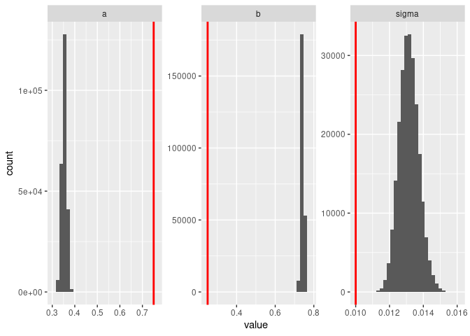

``` r
library(tidyverse, quietly = TRUE)
library(greta, quietly = TRUE)
library(bayesplot, quietly = TRUE)
source("R/utils.R")
source("R/stochastic.R")
```

``` r
set.seed(4242)
train_reps <- 10
train_t_max <- 250
test_t_max <- 250
test_reps <- 100
simulate <- simulate_stoch
```

``` r
p = list(sigma = 1e-2,
         a = 0.75, 
         b = 0.25,
         N_init = 0.75)
train <- purrr::map_dfr(1:train_reps, \(i) simulate(t_max=train_t_max, p), .id = "i")
test <- purrr::map_dfr(1:test_reps, \(i) simulate(t_max=test_t_max, p), .id = "i")
```

``` r
m <- greta_model_stoch(train)
```

    ## ℹ Initialising python and checking dependencies, this may take a moment.

    ## ✓ Initialising python and checking dependencies ... done!

    ## 

``` r
bench::bench_time({                 
  draws <- mmcmc(m, n_samples = 60000, warmup = 50000,
                 chains = 4, verbose = FALSE)
})
```

    ## process    real 
    ##   404ms   415ms

``` r
## draw test_reps number of samples
inits <- data.frame(N_init=p$N_init, t_init = 0)
combined <- compare_forecast(draws, train, test, simulate, vars = "N",
                              test_reps, test_t_max, inits = inits
                             ) 
```

    ## Note: Using an external vector in selections is ambiguous.
    ## ℹ Use `all_of(vars)` instead of `vars` to silence this message.
    ## ℹ See <https://tidyselect.r-lib.org/reference/faq-external-vector.html>.
    ## This message is displayed once per session.

``` r
write_csv(combined, "data/stochastic.csv.gz")
```

``` r
scores <-
  rep_scores(combined, "N") |> 
  mutate(scenario="stochastic", 
         model="MCMC", 
         reps = train_reps) 

write_csv(scores, "data/scores_stochastic.csv.gz")
```

``` r
bayesplot::mcmc_trace(draws)
```

<!-- -->

``` r
plot_posteriors(draws, p)
```

<!-- -->

``` r
ribbon <- 
combined |> 
  group_by(t,type,variable) |> 
  summarise(mean = mean(value), sd = sd(value), .groups = "drop") |> 
 ggplot(aes(t, col=type)) + 
  geom_ribbon(aes(ymin = pmax(mean-2*sd,0), ymax = mean+2*sd, fill=type), alpha=0.5) +
  geom_line(aes(y=mean)) +
  geom_vline(aes(xintercept = train_t_max)) + facet_wrap(~variable, ncol=1)
#ribbon
```

``` r
combined |> 
  filter(i %in% sample(i, 30)) |> 
  ggplot(aes(t, value, col=type, group=interaction(i,type))) + 
    geom_line(alpha=.30) +
    geom_vline(aes(xintercept = train_t_max)) + facet_wrap(~variable, ncol=1)
```

<!-- -->
